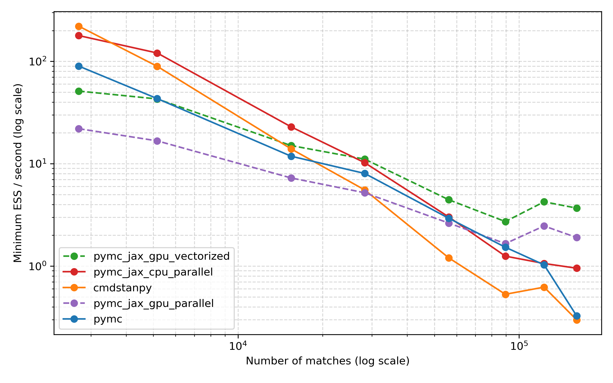

# MCMC benchmarks



This code compares Stan, PyMC, and PyMC + JAX numpyro sampler on a model for
tennis. It accompanies the blog post available
[here](https://martiningram.github.io/mcmc-comparison/).

### Setup notes

This benchmark uses Jeff Sackmann's tennis data. You can obtain it as follows:

```
git clone https://github.com/JeffSackmann/tennis_atp.git

# If you want to reproduce the results in the blog post, check out this commit:
cd tennis_atp && git checkout 89c20f1ef56f69db1b73b5782671ee85203b068a
```

Requirements that can be installed using pip are listed in
`requirements.txt`. Please install these first.

Once these are done, here are the steps I followed to setup PyMC v4 with JAX support:

* PyMC v4 installed using the instructions here: https://github.com/pymc-devs/pymc/wiki/Installation-Guide-(Linux)#pymc-v4-installation
* I am running an older version of CUDA (CUDA 10.1), so I couldn't use the
  latest version of JAX. I ended up installing jax v0.2.13 and jaxlib v0.1.65.
* I installed numpyro v0.8.0.
* I installed aeppl version 0.0.17.

To run the Stan code, it's best to install `cmdstanpy`. Instructions for
installing it can be found [here](https://mc-stan.org/cmdstanpy/installation.html).

### How to run

It's easiest to run the benchmarks using the `fit_all.sh` script. Make sure to
first edit the `target_dir` variable in it and amend it to a directory that
makes sense for you. All the model runs will be stored in it under
subdirectories.

Once benchmarks have been run, you can analyse the results and make plots using
the `Compare_runtimes.ipynb` notebook.
